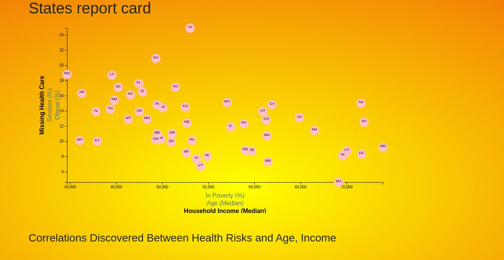

##  Data Journalism and D3

This graph is based on ACS 1-year estimates:   https://factfinder.census.gov/faces/nav/jsf/pages/searchresults.xhtml 

# Graph 
its looking at the corlation between people who need health care , % of them that are smokers , and Obese %. 
vs Household Income (Median), Age(Median), In Poverty (%)
 
 
The X and Y axis will change depending on which name is selelcted  I jused JavaScript , D3.js 
 JQuery , HTML/ CSS , bootstrap 
