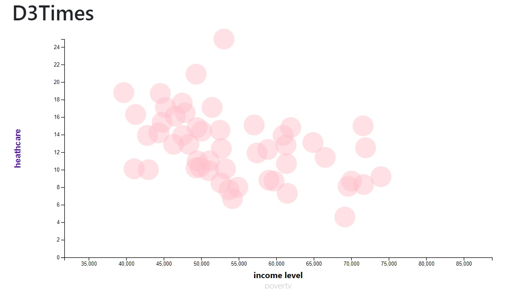

##  Data Journalism and D3

This graph is based on ACS 1-year estimates:   https://factfinder.census.gov/faces/nav/jsf/pages/searchresults.xhtml 
my graph is using # health care vs income and poverty taken from the data.csv data set
JavaScript file is  js/test2.js I pulled the data in using d3.csv from the file data/data.csv I used vs code , html some CSS JavaScript /d3 

clicking on the bottom x axis will see # income and poverty will change the  x values. 
Mouse over each plot will show the state with data. 
